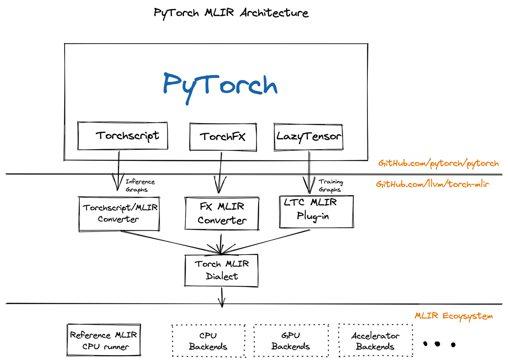
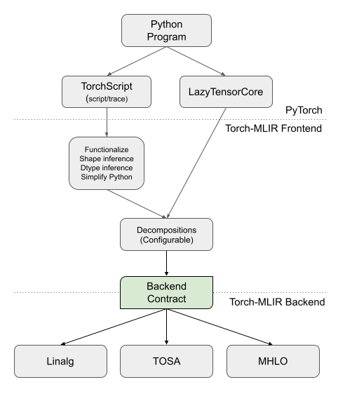

# Torch-MLIR

Code: [https://github.com/llvm/torch-mlir](https://github.com/llvm/torch-mlir)

 

## 构建torch-mlir环境

- 直接安装快照

```bash
conda create -n torch-mlir python=3.11 -y
conda activate torch-mlir
python -m pip install --upgrade pip

pip install --pre torch-mlir torchvision \
  --extra-index-url https://download.pytorch.org/whl/nightly/cpu \
  -f https://github.com/llvm/torch-mlir-release/releases/expanded_assets/dev-wheels
```

- 或编译安装

编译失败多次，暂时放弃

## torch-mlir测试

### 矩阵乘

- python代码

```python
import torch
from torch_mlir import fx
from torch_mlir.compiler_utils import run_pipeline_with_repro_report


class MulModel(torch.nn.Module):
    def __init__(self):
        super().__init__()

    def forward(self, x, y):
        return torch.matmul(x, y)


if __name__ == "__main__":
    input_x = torch.randn(3, 4)
    input_y = torch.randn(4, 3)
    print("Input tensors ...\n")
    print(f"{input_x}\n"
          f"{input_y}\n")

    model = MulModel()

    print("Pytorch infer ...\n")
    result = model.forward(input_x, input_y)
    print(f"{result}\n")

    module = fx.export_and_import(model, input_x, input_y)

    print("Generate ATEN IR ...\n")
    print(module)

    run_pipeline_with_repro_report(
        module,
        (
            "builtin.module("
            "func.func(torch-simplify-shape-calculations),"
            "func.func(torch-decompose-complex-ops),"
            "torch-backend-to-linalg-on-tensors-backend-pipeline)"
        ),
        "Lowering Torch IR to Linalg dialect",
        enable_ir_printing=False)

    print("Generate MLIR IR ...\n")
    print(module)
```

- 输出

```
Input tensors ...

tensor([[-1.6941, -1.5956,  2.6500,  0.6940],
        [-0.5094, -0.6371, -0.0372, -0.7704],
        [ 0.7837,  1.5455,  0.9153,  0.1721]])
tensor([[ 1.1701, -0.3016, -2.0718],
        [ 0.3632, -0.9225, -0.7194],
        [ 0.3483,  0.3780, -0.1266],
        [ 1.4833,  1.5459, -1.9157]])

Pytorch infer ...

tensor([[-0.6092,  4.0575,  2.9925],
        [-1.9833, -0.4637,  2.9944],
        [ 2.0524, -1.0501, -3.1811]])

Generate ATEN IR ...

module {
  func.func @main(%arg0: !torch.vtensor<[3,4],f32>, %arg1: !torch.vtensor<[4,3],f32>) -> !torch.vtensor<[3,3],f32> {
    %0 = torch.aten.matmul %arg0, %arg1 : !torch.vtensor<[3,4],f32>, !torch.vtensor<[4,3],f32> -> !torch.vtensor<[3,3],f32>
    return %0 : !torch.vtensor<[3,3],f32>
  }
}

Generate MLIR IR ...

module {
  func.func @main(%arg0: tensor<3x4xf32>, %arg1: tensor<4x3xf32>) -> tensor<3x3xf32> {
    %cst = arith.constant 0.000000e+00 : f32
    %0 = tensor.empty() : tensor<3x3xf32>
    %1 = linalg.fill ins(%cst : f32) outs(%0 : tensor<3x3xf32>) -> tensor<3x3xf32>
    %2 = linalg.matmul ins(%arg0, %arg1 : tensor<3x4xf32>, tensor<4x3xf32>) outs(%1 : tensor<3x3xf32>) -> tensor<3x3xf32>
    return %2 : tensor<3x3xf32>
  }
}
```

## DFT

- python代码

```python
import torch
from torch_mlir import fx
from torch_mlir.compiler_utils import run_pipeline_with_repro_report


class DFTModel(torch.nn.Module):
    def __init__(self):
        super().__init__()

    def forward(self, x_real, x_imag):
        N = x_real.size(0)
        n = torch.arange(N).unsqueeze(1)
        k = torch.arange(N).unsqueeze(0)

        M_real = torch.cos(2 * torch.pi * n * k / N)
        M_imag = -torch.sin(2 * torch.pi * n * k / N)

        result_real = torch.matmul(x_real, M_real) - torch.matmul(x_imag, M_imag)
        result_imag = torch.matmul(x_imag, M_real) + torch.matmul(x_real, M_imag)

        return result_real, result_imag


if __name__ == "__main__":
    input_real = torch.tensor([1.0, 2.0, 3.0, 4.0])
    input_imag = torch.zeros(4)
    print("Input tensors ...\n")
    print(f"Real: {input_real}\n"
          f"Imag: {input_imag}\n")

    model = DFTModel()

    print("Pytorch infer ...\n")
    result = model.forward(input_real, input_imag)
    print(f"Real: {result[0]}\n"
          f"Imag: {result[1]}\n")

    module = fx.export_and_import(model, input_real, input_imag)

    print("Generate ATEN IR ...\n")
    print(module)

    run_pipeline_with_repro_report(
        module,
        (
            "builtin.module("
            "func.func(torch-simplify-shape-calculations),"
            "func.func(torch-decompose-complex-ops),"
            "torch-backend-to-linalg-on-tensors-backend-pipeline)"
        ),
        "Lowering Torch IR to Linalg dialect",
        enable_ir_printing=False)

    print("Generate MLIR IR ...\n")
    print(module)
```

- 输出

```
Input tensors ...

Real: tensor([1., 2., 3., 4.])
Imag: tensor([0., 0., 0., 0.])

Pytorch infer ...

Real: tensor([10.0000, -2.0000, -2.0000, -2.0000])
Imag: tensor([ 0.0000e+00,  2.0000e+00, -2.5429e-07, -2.0000e+00])

Generate ATEN IR ...

module {
  func.func @main(%arg0: !torch.vtensor<[4],f32>, %arg1: !torch.vtensor<[4],f32>) -> (!torch.vtensor<[4],f32>, !torch.vtensor<[4],f32>) {
    %int4 = torch.constant.int 4
    %none = torch.constant.none
    %none_0 = torch.constant.none
    %cpu = torch.constant.device "cpu"
    %false = torch.constant.bool false
    %0 = torch.aten.arange %int4, %none, %none_0, %cpu, %false : !torch.int, !torch.none, !torch.none, !torch.Device, !torch.bool -> !torch.vtensor<[4],si64>
    %int1 = torch.constant.int 1
    %1 = torch.aten.unsqueeze %0, %int1 : !torch.vtensor<[4],si64>, !torch.int -> !torch.vtensor<[4,1],si64>
    %int4_1 = torch.constant.int 4
    %none_2 = torch.constant.none
    %none_3 = torch.constant.none
    %cpu_4 = torch.constant.device "cpu"
    %false_5 = torch.constant.bool false
    %2 = torch.aten.arange %int4_1, %none_2, %none_3, %cpu_4, %false_5 : !torch.int, !torch.none, !torch.none, !torch.Device, !torch.bool -> !torch.vtensor<[4],si64>
    %int0 = torch.constant.int 0
    %3 = torch.aten.unsqueeze %2, %int0 : !torch.vtensor<[4],si64>, !torch.int -> !torch.vtensor<[1,4],si64>
    %float6.283190e00 = torch.constant.float 6.2831853071795862
    %4 = torch.aten.mul.Scalar %1, %float6.283190e00 : !torch.vtensor<[4,1],si64>, !torch.float -> !torch.vtensor<[4,1],f32>
    %5 = torch.aten.mul.Tensor %4, %3 : !torch.vtensor<[4,1],f32>, !torch.vtensor<[1,4],si64> -> !torch.vtensor<[4,4],f32>
    %int4_6 = torch.constant.int 4
    %6 = torch.aten.div.Scalar %5, %int4_6 : !torch.vtensor<[4,4],f32>, !torch.int -> !torch.vtensor<[4,4],f32>
    %7 = torch.aten.cos %6 : !torch.vtensor<[4,4],f32> -> !torch.vtensor<[4,4],f32>
    %float6.283190e00_7 = torch.constant.float 6.2831853071795862
    %8 = torch.aten.mul.Scalar %1, %float6.283190e00_7 : !torch.vtensor<[4,1],si64>, !torch.float -> !torch.vtensor<[4,1],f32>
    %9 = torch.aten.mul.Tensor %8, %3 : !torch.vtensor<[4,1],f32>, !torch.vtensor<[1,4],si64> -> !torch.vtensor<[4,4],f32>
    %int4_8 = torch.constant.int 4
    %10 = torch.aten.div.Scalar %9, %int4_8 : !torch.vtensor<[4,4],f32>, !torch.int -> !torch.vtensor<[4,4],f32>
    %11 = torch.aten.sin %10 : !torch.vtensor<[4,4],f32> -> !torch.vtensor<[4,4],f32>
    %12 = torch.aten.neg %11 : !torch.vtensor<[4,4],f32> -> !torch.vtensor<[4,4],f32>
    %13 = torch.aten.matmul %arg0, %7 : !torch.vtensor<[4],f32>, !torch.vtensor<[4,4],f32> -> !torch.vtensor<[4],f32>
    %14 = torch.aten.matmul %arg1, %12 : !torch.vtensor<[4],f32>, !torch.vtensor<[4,4],f32> -> !torch.vtensor<[4],f32>
    %int1_9 = torch.constant.int 1
    %15 = torch.aten.sub.Tensor %13, %14, %int1_9 : !torch.vtensor<[4],f32>, !torch.vtensor<[4],f32>, !torch.int -> !torch.vtensor<[4],f32>
    %16 = torch.aten.matmul %arg1, %7 : !torch.vtensor<[4],f32>, !torch.vtensor<[4,4],f32> -> !torch.vtensor<[4],f32>
    %17 = torch.aten.matmul %arg0, %12 : !torch.vtensor<[4],f32>, !torch.vtensor<[4,4],f32> -> !torch.vtensor<[4],f32>
    %int1_10 = torch.constant.int 1
    %18 = torch.aten.add.Tensor %16, %17, %int1_10 : !torch.vtensor<[4],f32>, !torch.vtensor<[4],f32>, !torch.int -> !torch.vtensor<[4],f32>
    return %15, %18 : !torch.vtensor<[4],f32>, !torch.vtensor<[4],f32>
  }
}

Generate MLIR IR ...

#map = affine_map<(d0) -> (d0)>
#map1 = affine_map<(d0, d1) -> (d0, 0)>
#map2 = affine_map<(d0, d1) -> (d0, d1)>
#map3 = affine_map<(d0, d1) -> (0, d1)>
module {
  func.func @main(%arg0: tensor<4xf32>, %arg1: tensor<4xf32>) -> (tensor<4xf32>, tensor<4xf32>) {
    %cst = arith.constant 0.000000e+00 : f32
    %cst_0 = arith.constant 6.2831853071795862 : f64
    %cst_1 = arith.constant 4.000000e+00 : f32
    %0 = tensor.empty() : tensor<4xi64>
    %1 = linalg.generic {indexing_maps = [#map], iterator_types = ["parallel"]} outs(%0 : tensor<4xi64>) {
    ^bb0(%out: i64):
      %18 = linalg.index 0 : index
      %19 = arith.index_cast %18 : index to i64
      linalg.yield %19 : i64
    } -> tensor<4xi64>
    %expanded = tensor.expand_shape %1 [[0, 1]] output_shape [4, 1] : tensor<4xi64> into tensor<4x1xi64>
    %expanded_2 = tensor.expand_shape %1 [[0, 1]] output_shape [1, 4] : tensor<4xi64> into tensor<1x4xi64>
    %2 = tensor.empty() : tensor<4x1xf32>
    %3 = linalg.generic {indexing_maps = [#map1, #map2], iterator_types = ["parallel", "parallel"]} ins(%expanded : tensor<4x1xi64>) outs(%2 : tensor<4x1xf32>) {
    ^bb0(%in: i64, %out: f32):
      %18 = arith.sitofp %in : i64 to f32
      %19 = arith.truncf %cst_0 : f64 to f32
      %20 = arith.mulf %18, %19 : f32
      linalg.yield %20 : f32
    } -> tensor<4x1xf32>
    %4 = tensor.empty() : tensor<4x4xf32>
    %5 = linalg.generic {indexing_maps = [#map1, #map3, #map2], iterator_types = ["parallel", "parallel"]} ins(%3, %expanded_2 : tensor<4x1xf32>, tensor<1x4xi64>) outs(%4 : tensor<4x4xf32>) {
    ^bb0(%in: f32, %in_3: i64, %out: f32):
      %18 = arith.sitofp %in_3 : i64 to f32
      %19 = arith.mulf %in, %18 : f32
      linalg.yield %19 : f32
    } -> tensor<4x4xf32>
    %6 = linalg.generic {indexing_maps = [#map2, #map2], iterator_types = ["parallel", "parallel"]} ins(%5 : tensor<4x4xf32>) outs(%4 : tensor<4x4xf32>) {
    ^bb0(%in: f32, %out: f32):
      %18 = arith.divf %in, %cst_1 : f32
      linalg.yield %18 : f32
    } -> tensor<4x4xf32>
    %7 = linalg.generic {indexing_maps = [#map2, #map2], iterator_types = ["parallel", "parallel"]} ins(%6 : tensor<4x4xf32>) outs(%4 : tensor<4x4xf32>) {
    ^bb0(%in: f32, %out: f32):
      %18 = math.cos %in : f32
      linalg.yield %18 : f32
    } -> tensor<4x4xf32>
    %8 = linalg.generic {indexing_maps = [#map2, #map2], iterator_types = ["parallel", "parallel"]} ins(%6 : tensor<4x4xf32>) outs(%4 : tensor<4x4xf32>) {
    ^bb0(%in: f32, %out: f32):
      %18 = math.sin %in : f32
      linalg.yield %18 : f32
    } -> tensor<4x4xf32>
    %9 = linalg.generic {indexing_maps = [#map2, #map2], iterator_types = ["parallel", "parallel"]} ins(%8 : tensor<4x4xf32>) outs(%4 : tensor<4x4xf32>) {
    ^bb0(%in: f32, %out: f32):
      %18 = arith.negf %in : f32
      linalg.yield %18 : f32
    } -> tensor<4x4xf32>
    %10 = tensor.empty() : tensor<4xf32>
    %11 = linalg.fill ins(%cst : f32) outs(%10 : tensor<4xf32>) -> tensor<4xf32>
    %12 = linalg.vecmat ins(%arg0, %7 : tensor<4xf32>, tensor<4x4xf32>) outs(%11 : tensor<4xf32>) -> tensor<4xf32>
    %13 = linalg.vecmat ins(%arg1, %9 : tensor<4xf32>, tensor<4x4xf32>) outs(%11 : tensor<4xf32>) -> tensor<4xf32>
    %14 = linalg.generic {indexing_maps = [#map, #map, #map], iterator_types = ["parallel"]} ins(%12, %13 : tensor<4xf32>, tensor<4xf32>) outs(%10 : tensor<4xf32>) {
    ^bb0(%in: f32, %in_3: f32, %out: f32):
      %18 = arith.subf %in, %in_3 : f32
      linalg.yield %18 : f32
    } -> tensor<4xf32>
    %15 = linalg.vecmat ins(%arg1, %7 : tensor<4xf32>, tensor<4x4xf32>) outs(%11 : tensor<4xf32>) -> tensor<4xf32>
    %16 = linalg.vecmat ins(%arg0, %9 : tensor<4xf32>, tensor<4x4xf32>) outs(%11 : tensor<4xf32>) -> tensor<4xf32>
    %17 = linalg.generic {indexing_maps = [#map, #map, #map], iterator_types = ["parallel"]} ins(%15, %16 : tensor<4xf32>, tensor<4xf32>) outs(%10 : tensor<4xf32>) {
    ^bb0(%in: f32, %in_3: f32, %out: f32):
      %18 = arith.addf %in, %in_3 : f32
      linalg.yield %18 : f32
    } -> tensor<4xf32>
    return %14, %17 : tensor<4xf32>, tensor<4xf32>
  }
}
```

***
⭐ I like your Star!
🔙 [Go Back](README.md)
