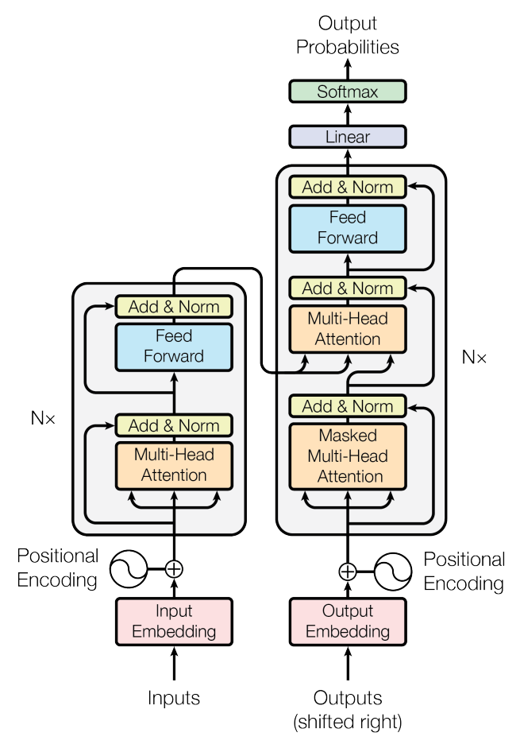
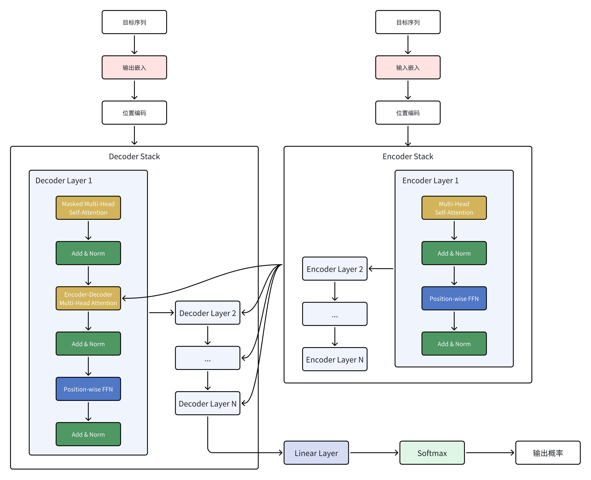

# Transformer框架学习

Paper: [Attention Is All You Need](https://arxiv.org/pdf/1706.03762)

## Transformer理论基础

### Transformer模型框架

 

- 整体结构：Encoder-Decoder

### 输入嵌入（Input Embedding）

- 输入序列X是离散符号（如单词ID）
- 通过嵌入矩阵查表，将每个符号xᵢ映射为稠密向量eᵢ（维度d_model）

```
X = (x₁, x₂, ..., xₙ) --> E = (e₁, e₂, ..., eₙ)
eᵢ = EmbeddingLookup(xᵢ)    # eᵢ ∈ ℝ^(d_model)
```

### 位置编码（Positional Encoding）

- 为序列位置注入顺序信息，避免自注意力丢失位置关系
- 使用正弦/余弦函数生成固定编码（非可学习）

```
PE(pos, 2i) = sin(pos / 10000^(2i / d_model))
PE(pos, 2i+1) = cos(pos / 10000^(2i / d_model))

Z = E + PE    # Z ∈ ℝ^(n × d_model)
```

### 自注意力（Self-Attention）

- 计算每个位置与其他位置的关联权重（softmax归一化）
- 缩放因子√d_k防止点积过大导致梯度消失
- Mask在解码器中屏蔽未来位置（编码器通常不适用）

```
Q = X * W^Q    # W^Q ∈ ℝ^(d_model × d_k)    Q ∈ ℝ^(n × d_k)
K = X * W^K    # W^K ∈ ℝ^(d_model × d_k)    K ∈ ℝ^(n × d_k)
V = X * W^V    # W^V ∈ ℝ^(d_model × d_v)    V ∈ ℝ^(n × d_v)

Scores = Q * K^T    # Scores ∈ ℝ^(n × n)
Scaled_Scores = Scores / √d_k    # Scaled_Scores ∈ ℝ^(n × n)

Attention(Q, K, V) = softmax((Q * K^T) / √d_k + Mask) * V    # Output ∈ ℝ^{n × d_v}
```

### 多头注意力（Multi-Head Attention）

- 并行执行h组自注意力，捕捉不同子空间的特征
- 拼接后通过线性层W^O融合信息并恢复维度

```
head_i = Attention(X * W_i^Q, X * W_i^K , X * W_i^V)    # head_i ∈ ℝ^(n × d_v)

Concat_Heads = [head_1; head_2; ...; head_h]    # Concat_Heads ∈ ℝ^(n × (h * d_v))

MultiHeadOutput = Concat_Heads * W^O
# W^O ∈ ℝ^(d_model × d_model)    MultiHeadOutput ∈ ℝ^(n × d_model)
```

### 位置式前馈神经网络（Position-wise Feed-Forward Network - FFN）

- 对每个位置独立应用两层全连接网络（ReLU激活）

```
FFN(xᵢ) = max(0, xᵢ * W₁ + b₁) * W₂ + b₂
# W₁ ∈ ℝ^(d_model × d_ff)    b₁ ∈ ℝ^(d_ff)
# W₂ ∈ ℝ^(d_ff × d_model)    b₂ ∈ ℝ^(d_model)
```

### 残差连接（Residual Connection）与层归一化（Layer Normalization）

- 残差连接缓解梯度消失，层归一化稳定训练

```
X' = X + Sublayer(X)

LN(x'ᵢ) = γ * (x'ᵢ - μᵢ) / σᵢ + β

μᵢ = mean(x'ᵢ)
σᵢ = std(x'ᵢ)
γ ∈ ℝ^(d_model)
```

### 编码器（Encoder）

- 由N个相同的编码器层堆叠而成
- 编码器层：多头自注意力 --> 残差&归一化 --> FFN --> 残差&归一化

```
Z' = LN(Z + MultiHeadAttention(Z, Z, Z))
EncoderOutput = LN(Z' + FFN(Z'))
```

### 解码器（Decoder）

- 由N个相同的解码器层堆叠而成
- 解码器层：掩码自注意力 --> 残差&归一化 --> 编码器-解码器注意力 --> 残差&归一化 --> FFN --> 残差&归一化

```
D' = LN(D + MultiHeadAttention(D, D, D, Mask))
D'' = LN(D' + MultiHeadAttention(D', EncoderOutput, EncoderOutput))
DecoderOutput = LN(D'' + FFN(D''))
```

### 输出层（Linear层与Softmax）

- 线性层将解码器输出映射到词表大小
- Softmax生成每个位置的词概率分布

```
Logits = DecoderOutput * W_vocab    # W_vocab ∈ ℝ^{n × vocab_size}

P(w | context) = softmax(Logits[i])
```

## Pytorch构建Transformer框架

- 参考代码：[abd_transformer_cyd.py](assets/abd_transformer_cyd.py)

带注释版本代码已备份到本开源仓库，根据BY-NC-SA许可协议注明出处：

> 作者：【B站：水论文的程序猿】 \
链接：https://www.cnblogs.com/nickchen121/p/16518613.html
